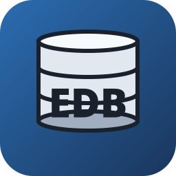
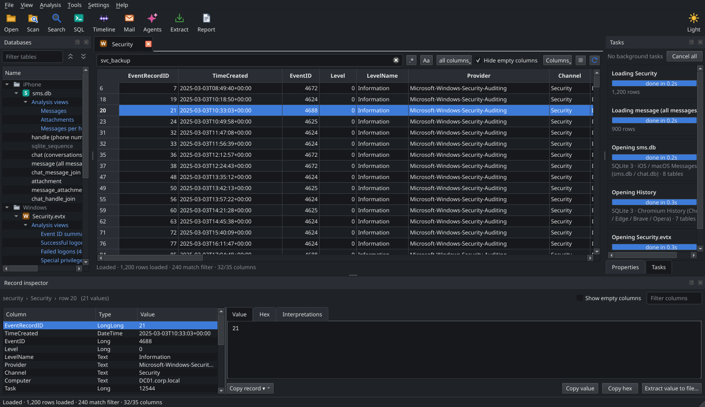
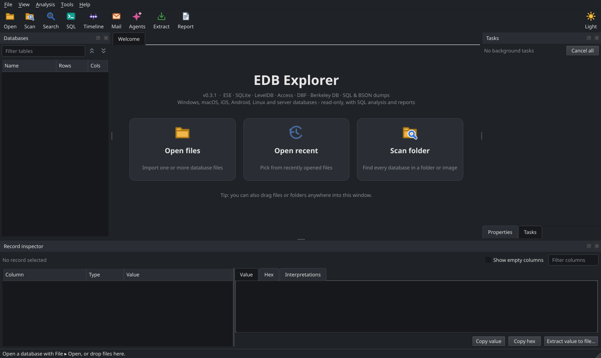
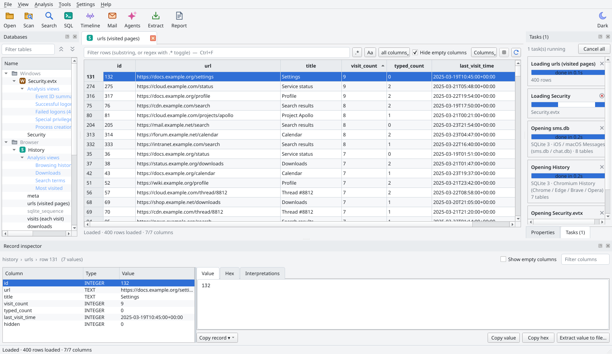
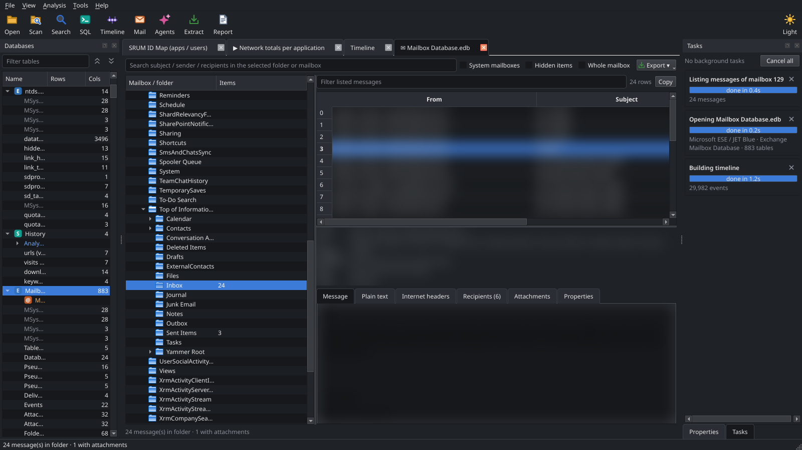
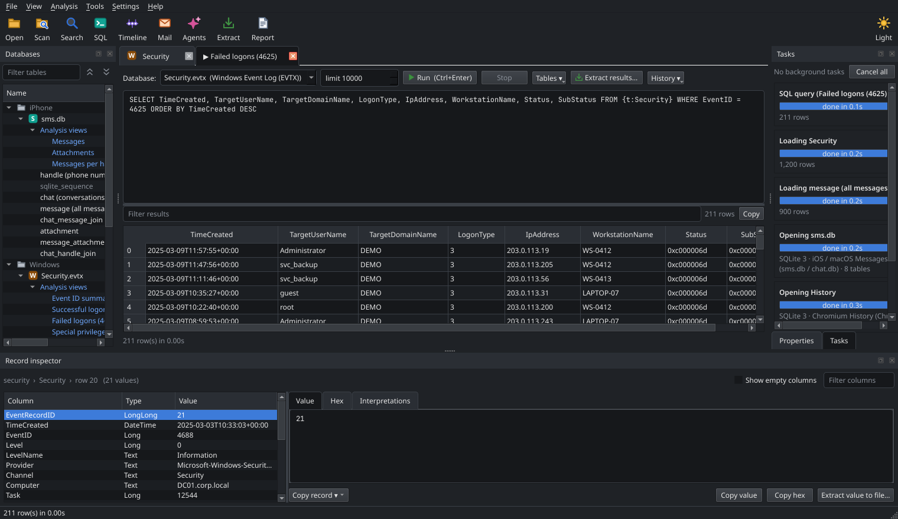
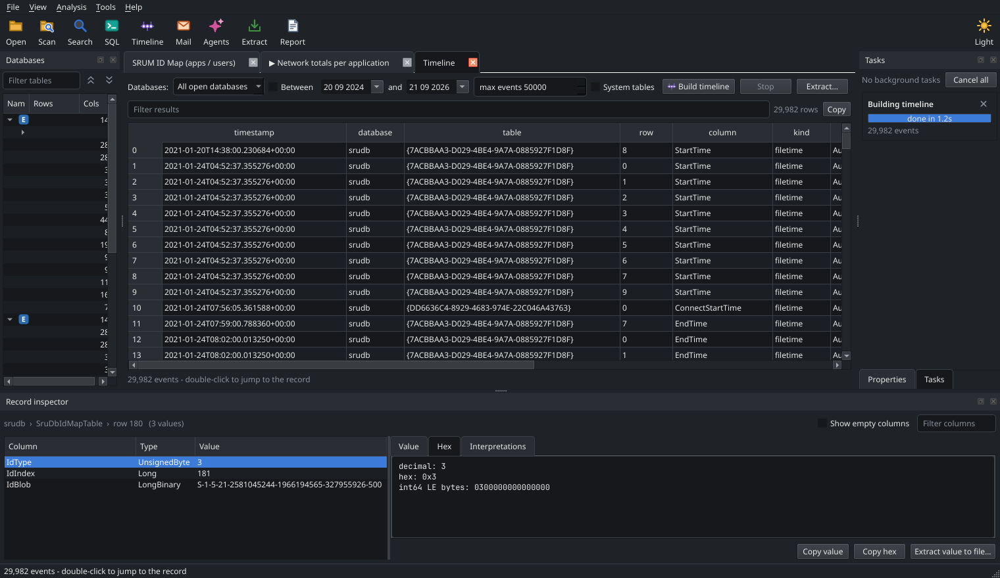
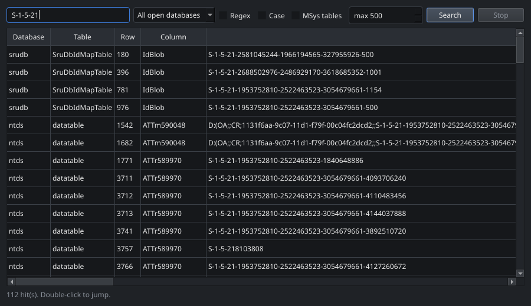

<p align="center">
  
</p>

<h1 align="center">EDB Explorer</h1>

<p align="center">
  Cross-platform GUI, CLI and <a href="https://modelcontextprotocol.io">MCP server</a> for forensic database analysis.
  Opens <b>ESE</b> (<code>ntds.dit</code>, <code>SRUDB.dat</code>, Exchange, WebCache), <b>SQLite</b> (iOS, Android,
  browsers, macOS, Windows apps), <b>LevelDB</b> (Chromium / Electron), <b>Access</b>, <b>dBase</b>, <b>Berkeley DB</b>
  and <b>SQL / BSON dumps</b> - read-only - with SQL over any of them, a cross-database timeline, artifact views for
  ~50 applications, multi-format extraction and analyst reports.
</p>

<p align="center">
  <a href="https://github.com/keyuraghao/EDB_FILE_EXPLORER/actions/workflows/ci.yml"></a>
  <a href="https://github.com/keyuraghao/EDB_FILE_EXPLORER/releases"></a>
  
  
  <a href="LICENSE"></a>
</p>

<p align="center">
  
</p>

---

## Why

Evidence lives in databases: the Active Directory store, SRUM's per-app network usage, a phone's messages and
call log, browser history, macOS's knowledgeC, a web app's LevelDB cache, an old Access application, a
mysqldump from a compromised server. Each has its own file format, its own timestamp encoding and its own
"where is the interesting table" knowledge. Most tools handle one of them, on one OS.

EDB Explorer opens **all of them** on **Linux, Windows and macOS** with pure-Python parsers (no `esent.dll`, no
`sqlite3` locks on the evidence, no native LevelDB), decodes timestamps per application, and exposes the same
read-only engine three ways:

| Interface | Command | For |
|---|---|---|
| **Desktop GUI** | `EDB-Explorer` / `edb-explorer` | analysts browsing many databases side by side |
| **CLI** | `edb-explorer info / tables / dump / sql / views / timeline / export / report …` | scripting and quick triage |
| **MCP server** | `edb-explorer mcp` | AI agents (Claude Desktop, Claude Code, Cursor, any MCP client) |

Everything is **strictly read-only** - the tool never writes to an evidence file.

## Features

**Any database, one UI**
- ESE / JET Blue, SQLite (WAL sidecars merged, SQLCipher-aware parser), LevelDB directories, Access `.mdb`/`.accdb`,
  dBase `.dbf` (incl. soft-deleted records), Berkeley DB, `mysqldump` / `pg_dump` / `sqlite .dump` text, `mongodump` `.bson`.
- Formats are detected by signature, not extension; scan a folder or a mounted image and everything supported is listed.
- Open many databases at once (`Ctrl+O`), drag-and-drop files or folders, welcome screen with **Open / Recent / Scan**
  buttons, a **Tasks** panel showing a progress bar for every file being opened or table being loaded while you keep
  working, collapse / expand all databases with one click.

<p align="center">
  
</p>

- **Light and dark themes** (View ▸ Theme: Light / Dark / Follow system, or the sun / moon button at the right of the
  toolbar, `Ctrl+Shift+D`); every toolbar action has its own icon.

<p align="center">
  
</p>

**Application knowledge** (see [docs/formats.md](docs/formats.md))
- 52 profiles: NTDS, SRUM, Exchange, WebCache, Windows Search, UAL, Windows Timeline, Notifications, Chrome/Edge
  history, cookies, logins, autofill, Firefox, Safari, iOS Messages, AddressBook, CallHistory, knowledgeC, Photos,
  Notes, Calendar, backup Manifest, WhatsApp (iOS + Android), Android contacts / calls / SMS / downloads / media,
  Telegram, Skype, Signal Desktop, Thunderbird, Zeitgeist, macOS Quarantine / TCC / Notification Center, Chromium
  Local Storage / IndexedDB, WordPress dumps, RPM databases …
- Friendly table names, per-column timestamp decoding (WebKit, Cocoa s/ns, Unix s/ms/µs, FILETIME, OLE, PRTime) and
  **artifact views** - ready-made SQL such as *Browsing history*, *Messages with handles*, *Network usage by
  application*, *Quarantined downloads* - one double-click away.

**Exchange mailbox viewer** (`Ctrl+M`, or double-click *Mailboxes* under an Exchange database)
- Mail-client layout: mailboxes → folders → message list → preview (rendered HTML / plain text / internet
  headers / recipients / attachments / every MAPI property). Works on Exchange 2013+ databases by decoding the
  store's property blobs directly - no Exchange server, no PST.
- Export selected messages, a folder or a whole mailbox as **EML** (attachments embedded), **HTML**, **TXT** or
  **JSON**; save attachments; export the message list to xlsx/csv/pdf.

<p align="center">
  
</p>

**AI agents inside the app** (`Ctrl+Shift+A`)
- Embedded terminal running **Claude Code, OpenAI Codex CLI, Gemini CLI, GitHub Copilot CLI, Aider**, a shell
  or any command. *Configure MCP* registers this tool's MCP server with the agent (scoped to the folders of the
  open databases), *Login* / *Start* do the rest - the agent can then call `run_sql`, `timeline`,
  `exchange_messages`, `generate_report`… on the evidence you have open.

**Analysis**
- **SQL console** over *any* format: tables are materialised into SQLite with decoded values; every open database is
  attached as a schema so you can join a phone's messages against a laptop's browser history.

<p align="center">
  
</p>

- **Timeline**: every timestamp column of every table (detected by profile hints or value heuristics) becomes an
  event; filter by date range, double-click to jump to the record, extract to xlsx/csv/pdf.

<p align="center">
  
</p>

- **Column statistics**: nulls, distinct values, min/max/mean, top values, and the detected timestamp encoding +
  date range per column.
- Record inspector with hex dump and every interpretation of a value (UTF-16, SID, GUID, 9 timestamp readings).
- **Find in databases** (`Ctrl+Shift+F`): substring or regex across every column of every table of every open
  database; double-click a hit to jump to the record.

<p align="center">
  
</p>

**Extract** (`Ctrl+E`, right-click → *Extract selected rows…*)
- Selected rows, displayed rows, query results, whole tables or whole databases → **CSV, XLSX, JSON, JSON Lines,
  TXT, PDF** (a database → one workbook with a sheet per table).

**Reports** (`Ctrl+R`) - file metadata, SHA-256, format state, table inventory with counts, schema and sample rows,
case ID / analyst / notes → **HTML, PDF, DOCX, Markdown, XLSX, TXT, JSON**.

## Supported databases

| Format | Examples | Notes |
|---|---|---|
| Microsoft ESE | `ntds.dit`, `SRUDB.dat`, Exchange `.edb`, `WebCacheV01.dat`, `Windows.edb`, UAL `.mdb`, `DataStore.edb` | schema, indexes, long values, multi-values, template tables; Exchange mailboxes decoded into a mail-client view |
| SQLite 3 | iOS `sms.db`, `AddressBook.sqlitedb`, `CallHistory.storedata`, `knowledgeC.db`, `Photos.sqlite`, Android `contacts2.db` / `mmssms.db` / `calllog.db`, WhatsApp, Chrome `History` / `Cookies` / `Login Data`, Firefox `places.sqlite`, Safari `History.db`, `ActivitiesCache.db`, `wpndatabase.db`, `TCC.db` … | WAL merged, no locks on evidence |
| LevelDB | Chrome/Edge *Local Storage*, *Session Storage*, *IndexedDB*, Discord, Teams, Slack, VS Code | `live` and `all_records` (incl. deleted / superseded) |
| Access | `.mdb` (Jet 3/4), `.accdb` (ACE) | |
| dBase / FoxPro | `.dbf` (+ `.dbt`/`.fpt` memos) | soft-deleted records exposed |
| Berkeley DB | RPM `Packages`, `cert8.db` / `key3.db`, sendmail maps | btree / hash / recno |
| SQL dump | `mysqldump`, `pg_dump` (incl. `COPY`), `sqlite .dump` | loaded into SQLite, then queryable |
| BSON dump | `mongodump` collections | nested documents flattened to JSON |

The full list of profiles, their signature tables and views is in [docs/formats.md](docs/formats.md).

## Install

### Binaries (no Python needed)

Grab the build for your OS from the [releases page](https://github.com/keyuraghao/EDB_FILE_EXPLORER/releases):

| OS | File | How to run |
|---|---|---|
| Windows | `EDB-Explorer-<ver>-setup.exe` | run the installer → **EDB Explorer** appears in the Start Menu / desktop (no console window) |
| Windows (portable) | `edb-explorer-<ver>-windows-x64.zip` | unzip, double-click `EDB-Explorer.exe` |
| Linux | `edb-explorer-<ver>-linux-x86_64.tar.gz` | extract, double-click `EDB-Explorer`, or run `./install.sh` once to add it to your app menu |

Each bundle also contains the `edb-explorer` console program for the CLI and MCP server. Running it
without arguments opens the GUI too.

### From PyPI / source

```bash
pip install "edb-explorer[all]"          # GUI + MCP
pip install "edb-explorer[mcp]"          # headless: CLI + MCP server only (no Qt)

# or from a checkout
git clone https://github.com/keyuraghao/EDB_FILE_EXPLORER && cd edb-explorer
uv sync --all-extras && uv run edb-explorer gui
```

Requires Python 3.10+. On minimal Linux servers the GUI needs the usual Qt runtime libraries
(`libegl1 libgl1 libxkbcommon0 libdbus-1-3 libfontconfig1`).

## Usage

### GUI

```bash
edb-explorer                                       # welcome screen (Open files / Open recent / Scan folder)
edb-explorer gui SRUDB.dat sms.db "Local Storage/leveldb" places.sqlite
```

| Shortcut | Action |
|---|---|
| `Ctrl+O` / `Ctrl+Shift+O` | open files / scan a folder |
| `Ctrl+Q` / `Ctrl+L` / `Ctrl+I` | SQL console / timeline / column statistics |
| `Ctrl+F` / `Ctrl+Shift+F` | filter rows in the current table / search every table |
| `Ctrl+E` / `Ctrl+Shift+E` | extract table or view / extract selected rows |
| `Ctrl+R` | generate report |
| `Ctrl+T` | timestamp decoder |
| `Ctrl+Shift+D` | toggle light / dark theme |
| `Ctrl+W` / `Ctrl+Shift+W` | close tab / close database |

### CLI

```bash
edb-explorer info SRUDB.dat --hash                     # metadata, profile, SHA-256
edb-explorer tables ntds.dit --count                   # table inventory with record counts
edb-explorer schema SRUDB.dat "Network Data Usage"     # columns and indexes (friendly names work)
edb-explorer dump SRUDB.dat SruDbIdMapTable -n 20 -g svchost -f jsonl
edb-explorer search WebCacheV01.dat "login.microsoftonline.com" --regex
edb-explorer export ntds.dit -o out/ -f xlsx           # whole database -> out/ntds.xlsx
edb-explorer export SRUDB.dat -t "Network Data Usage" -o net.pdf -f pdf
edb-explorer report SRUDB.dat ntds.dit -o case.docx --case CASE-2026-001 --analyst "J. Doe"
edb-explorer scan /mnt/evidence                        # every supported database, by signature
edb-explorer sql sms.db "SELECT COUNT(*) FROM message WHERE is_from_me = 1"
edb-explorer views History                             # list artifact views for this database type
edb-explorer views History history -o history.xlsx     # run one and extract it
edb-explorer stats places.sqlite moz_places            # column statistics + timestamp encodings
edb-explorer timeline sms.db History SRUDB.dat -o timeline.xlsx --start 2021-01-01
edb-explorer summary knowledgeC.db                     # analysis overview (JSON)
edb-explorer formats                                   # what can be opened
edb-explorer timestamp 132565120200137766              # FILETIME? OLE? Unix? Cocoa? all readings
edb-explorer mailboxes "Mailbox Database.edb"          # Exchange: mailboxes
edb-explorer mail "Mailbox Database.edb" -m 129 --folder Inbox --export out/ -f eml
edb-explorer agents --configure claude --allow /cases/001   # register the MCP server with Claude Code
```

Every command has `--json` output where it makes sense and `--help`.

### MCP server (AI agents)

```bash
edb-explorer mcp                                  # stdio (default) - what Claude Desktop / Claude Code / Cursor use
edb-explorer mcp --allow /cases/001/evidence      # restrict what the agent may open (recommended)
edb-explorer mcp --transport streamable-http --port 8765
edb-explorer mcp SRUDB.dat ntds.dit               # pre-open databases at startup
```

Claude Code:

```bash
claude mcp add edb-explorer -- edb-explorer mcp --allow /cases/001/evidence
```

Claude Desktop / Cursor (`claude_desktop_config.json`, `.cursor/mcp.json`):

```json
{
  "mcpServers": {
    "edb-explorer": {
      "command": "edb-explorer",
      "args": ["mcp", "--allow", "/cases/001/evidence"]
    }
  }
}
```

Docker (headless, Streamable HTTP on `:8765`, evidence mounted read-only):

```bash
docker run --rm -p 8765:8765 -v /cases/001/evidence:/evidence:ro ghcr.io/keyuraghao/EDB_FILE_EXPLORER
```

**Tools exposed** (31) - `open_database`, `scan_directory`, `list_databases`, `close_database`,
`get_database_info`, `database_summary`, `list_tables`, `describe_table`, `count_records`, `query_table`
(paging + filters), `get_record`, `get_record_raw` (hex + every decoding), `search`, **`run_sql`** (any format,
cross-database), **`list_views`** / **`run_view`**, **`column_statistics`**, **`detect_timestamps`**, **`timeline`**,
`export_table_to_file`, `export_database_to_directory`, `generate_report`, `interpret_timestamp`,
`list_known_profiles`, `list_formats`, **`exchange_mailboxes` / `exchange_folders` / `exchange_messages` /
`exchange_message` / `exchange_export` / `exchange_save_attachment`**; resources `edb://databases`, `edb://{db}/tables`, `edb://{db}/{table}/schema`;
prompt `triage_database`. See [docs/mcp.md](docs/mcp.md).

An agent conversation typically looks like:

> *"Open the phone's sms.db and the laptop's Chrome History, tell me what happened on 2021-01-30 and write
> a report."* → `open_database` ×2 → `database_summary` → `run_view("sms", "messages")` →
> `timeline(start="2021-01-30", end="2021-01-31")` → `run_sql(...)` → `generate_report(...)`

## Architecture

```
src/edb_explorer/
├── core/                 UI-agnostic engine (no Qt)
│   ├── backends/         one module per format: ese, sqlite, leveldb, access, dbf, bsddb, sqldump, bsondump
│   │   └── __init__.py   signature detection + registry
│   ├── database.py       Database: thread-safe read-only wrapper over a backend
│   ├── session.py        many open databases, stable ids, path allow-list, directory scan
│   ├── profiles.py       ESE profiles + Profile/ArtifactView model;  profiles_apps.py: phones, browsers, macOS, Windows, servers
│   ├── values.py         timestamp / SID / GUID / UTF-16 decoding, encoding guesser, hexdump
│   ├── sqlworkspace.py   SQL over any backend (materialised into SQLite, one schema per database)
│   ├── analysis.py       timestamp detection, column statistics, timeline, summary
│   ├── exchange/         Exchange store: ProP property blobs, RTF, mailboxes/folders/messages, EML/HTML export
│   ├── agents.py         AI agent CLI detection and MCP registration (Claude Code, Codex, Gemini, Copilot)
│   ├── search.py, formats.py, export.py, report.py
├── gui/                  PySide6 application (welcome page, task panel, mailbox viewer, embedded terminal, dialogs)
├── mcp/                  MCP server built on the core
└── cli.py                Typer CLI
```

Adding a format = one backend module implementing `tables()` / `iter_rows()` / `info()` plus a signature in
`backends/__init__.py`; adding an application = one `Profile` in `profiles_apps.py`.

```python
from edb_explorer.core import Session
from edb_explorer.core.sqlworkspace import SqlWorkspace
from edb_explorer.core.analysis import build_timeline

s = Session()
phone = s.open("sms.db")             # SQLite, profile "iOS / macOS Messages"
laptop = s.open("History")           # SQLite, profile "Chromium History"
srum = s.open("SRUDB.dat")           # ESE, profile "SRUM"

ws = SqlWorkspace()
print(ws.run_view(phone, "messages", limit=5).rows)
print(ws.query_database(srum, "SELECT COUNT(*) FROM SruDbIdMapTable").rows)
events, _ = build_timeline([phone, laptop, srum], limit=10_000)
```

## Development

```bash
uv sync --all-extras
uv run pytest                                     # 50+ unit tests on a fake ESE backend, no evidence needed
EDB_EXPLORER_TEST_DB=/path/to/any.edb uv run pytest -m integration
uv run ruff check src tests && uv run ruff format src tests && uv run mypy src/edb_explorer/core
./packaging/build.sh                              # Linux/macOS bundle   (Windows: packaging\build.ps1)
```

See [CONTRIBUTING.md](CONTRIBUTING.md) for the layout, how to add a database profile and the
release process, and [SECURITY.md](SECURITY.md) for MCP hardening notes.

## Acknowledgements

- [dissect.esedb](https://github.com/fox-it/dissect.esedb) and [dissect.database](https://github.com/fox-it/dissect.database)
  by Fox-IT - the ESE, SQLite and Berkeley DB parsers doing the heavy lifting.
- [libesedb](https://github.com/libyal/libesedb) documentation by Joachim Metz for the ESE format reference;
  Google's LevelDB `log_format.md` / `table_format.md` for the LevelDB reader.
- [access-parser](https://github.com/claroty/access_parser), [dbfread](https://github.com/olemb/dbfread),
  [cramjam](https://github.com/milesgranger/cramjam), [bson](https://github.com/py-bson/bson).
- Built with [PySide6](https://www.qt.io/qt-for-python), [Typer](https://typer.tiangolo.com),
  [MCP Python SDK](https://github.com/modelcontextprotocol/python-sdk), openpyxl, reportlab and python-docx.

## License

MIT - see [LICENSE](LICENSE).
